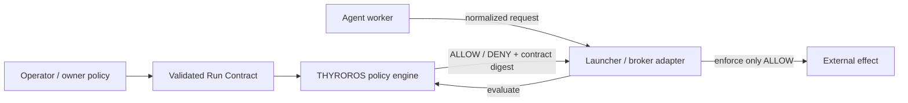

<div align="center">

# THYROROS

### Agent Runtime Gate & Flight Recorder

**Run Contract validation and policy checks for autonomous AI agents.**


<p>
  
  
  
  <a href="https://github.com/urotsuki-san/THYROROS/actions/workflows/ci.yml"></a>
  <a href="LICENSE"></a>
</p>

**[Quick start](#quick-start)** · **[Policy engine](#reference-policy-engine)** · **[Python API](#python-api)** · **[Architecture](docs/ARCHITECTURE.md)** · **[Security](SECURITY.md)**

<sub>Pronunciation: <strong>/θi.roˈros/</strong> — roughly <strong>thee-ro-ROSS</strong> · Japanese project reading: <strong>シロロス</strong> · Greek <strong>θυρωρός</strong>: doorkeeper / gatekeeper</sub>

</div>

---

> [!IMPORTANT]
> **THYROROS 0.2.0 validates contracts and policy requests. It is not a sandbox.**
>
> A launcher or broker can use its decisions to enforce a Run Contract. THYROROS 0.2.0 does not
> intercept actions, isolate processes, handle credentials, or produce tamper-resistant receipts.

Delegated runs follow one rule:

```text
child authority ⊆ parent authority
```

A child contract may narrow its parent contract, but it cannot add authority.

## What is usable today

THYROROS 0.2.0 can:

- validate Run Contract v1 JSON and calculate its canonical SHA-256 digest;
- compare parent and child contracts by path-scope meaning rather than string equality;
- check file, HTTPS, executable, secret-reference, and effect-class requests;
- return stable `ALLOW`, `DENY`, and `HOLD` results from the CLI or Python API.

The runtime package has no third-party dependencies.

## Quick start

### Install from a checked-out repository

```bash
python -m pip install .
thyroros --version
```

For source-tree development without installation:

```bash
# PowerShell
$env:PYTHONPATH = "src"

# Linux / macOS
export PYTHONPATH=src
```

### Validate and digest a contract

```bash
thyroros contract validate examples/run-contract.json
thyroros contract digest examples/run-contract.json
thyroros contract validate examples/run-contract.json --json
```

Expected text output:

```text
PASS thyroros.run-contract v1
digest sha256:...
```

Use `-` instead of a file path to read a contract from standard input. Input is limited to 1 MiB.

### Evaluate a file request

The bundled example uses fixed timestamps, so this command supplies an explicit evaluation time:

```bash
thyroros authorize file examples/run-contract.json \
  --operation read \
  --path workspace/src/thyroros/cli.py \
  --at 2026-08-24T09:30:00Z \
  --json
```

```json
{
  "allowed": true,
  "code": "file_allowed",
  "contract_digest": "sha256:...",
  "decision": "ALLOW",
  "matched_rule": "workspace/**",
  "message": "read is admitted by the matched scope"
}
```

### Evaluate an HTTPS request

```bash
thyroros authorize network examples/run-contract.json \
  --method GET \
  --url "https://api.github.com/repos/urotsuki-san/THYROROS/issues?state=open" \
  --requests-used 0 \
  --at 2026-08-24T09:30:00Z
```

This checks the request against the contract. It does not send the request.

## Reference policy engine

| Surface | Contract authority | Check |
|---|---|---|
| File | `read`, `write`, `deny` | relative path; deny takes precedence; whole-segment wildcards |
| Network | `network.allow` | HTTPS; exact host and port; method and segment-aware path prefix |
| Process | `process.allowed_images`, `max_children` | executable basename and current child count |
| Secret | `secrets` | exact `secret:<namespace>/<name>` reference |
| Effect | `maximum_effect` | ordered ceiling from `PURE` through `IRREVERSIBLE` |
| Lease | `created_at`, `expires_at` | `[created_at, expires_at)` |
| Budget | `network_requests` | caller-supplied usage against the contract limit |

See [`docs/POLICY_ENGINE.md`](docs/POLICY_ENGINE.md) for request normalization and integration notes.

### Portable path-scope language

Run Contract v1 uses three kinds of path segment:

| Segment | Meaning |
|---|---|
| `src` | exact literal segment |
| `*` | exactly one segment |
| `**` | zero or more segments |

Wildcards embedded in names such as `*.py` are rejected. Paths are relative and NFC-normalized, use
forward slashes, and reject traversal, control characters, drive syntax, and Windows reserved device
names.

The restricted grammar allows exact scope-inclusion checks. For example, `workspace/**` covers
`workspace/src/**`. If a child scope is broader than its parent, the comparison reports an example
path that falls outside the parent scope.

## Python API

```python
from datetime import datetime, timezone

from thyroros import PolicyEngine, load_contract

contract = load_contract("examples/run-contract.json")
engine = PolicyEngine(contract)

result = engine.authorize_file(
    "write",
    "workspace/src/thyroros/policy.py",
    at=datetime(2026, 8, 24, 9, 30, tzinfo=timezone.utc),
)

if not result.allowed:
    raise PermissionError(result.code)

print(result.contract_digest)
```

`PolicyEngine` copies and freezes the validated contract when it is created. Mutating the caller's
original object does not change later decisions.

### Compare delegated authority

```python
from thyroros import compare_child_authority, load_contract

parent = load_contract("parent.json")
child = load_contract("child.json")
comparison = compare_child_authority(parent, child)

if not comparison.allowed:
    for violation in comparison.violations:
        print(violation.code, violation.path, violation.message)
```

### Access the packaged schema

```python
from thyroros import schema_document

schema = schema_document()
```

The schema in [`schemas/run-contract.schema.json`](schemas/run-contract.schema.json) is also bundled
in the wheel. Repository checks verify that the two copies are identical.

## CLI contract

| Exit | Meaning |
|---:|---|
| `0` | valid document, allowed request, or valid narrowing |
| `2` | invalid contract or malformed/ambiguous request |
| `3` | valid request denied, or child authority held |
| `70` | unexpected internal failure at the CLI boundary |

Available commands:

```text
thyroros name
thyroros contract validate|digest|canonicalize|schema
thyroros authority compare
thyroros authorize file|network|process|secret|effect
```

`contract canonicalize --output FILE` and `contract schema --output FILE` create a new file and
refuse to overwrite an existing path.

## Runtime architecture



The policy engine only returns a decision. The launcher or broker is responsible for intercepting the
operation, resolving the real resource, maintaining counters and process state, and enforcing a
denial.

## Security boundary

THYROROS 0.2.0 is a policy library, not an enforcement boundary:

- a process can bypass it unless an external component intercepts the operation;
- an OS adapter must resolve logical paths without symlink, junction, reparse-point, or TOCTOU escape;
- network request counts and child-process counts must be owned by the enforcing component;
- contracts contain secret references, not raw credentials.

See [`SECURITY.md`](SECURITY.md), [`docs/THREAT_MODEL.md`](docs/THREAT_MODEL.md), and
[`docs/SECURITY_INVARIANTS.md`](docs/SECURITY_INVARIANTS.md) before using it in a security-sensitive
integration.

## Repository verification

```bash
python scripts/check_repo.py
```

The repository check compiles the Python sources, validates schemas and examples, runs the unit
tests, builds wheel and source distributions, installs the wheel in an isolated target, checks local
Markdown links, and scans for common secret-file mistakes.

CI runs the same command on supported Python versions for Windows, Linux, and macOS.

## Documentation

| Document | Purpose |
|---|---|
| [`docs/CHARTER.md`](docs/CHARTER.md) | project scope and non-goals |
| [`docs/POLICY_ENGINE.md`](docs/POLICY_ENGINE.md) | policy request semantics |
| [`docs/THREAT_MODEL.md`](docs/THREAT_MODEL.md) | assets, adversaries, and trust assumptions |
| [`docs/SECURITY_INVARIANTS.md`](docs/SECURITY_INVARIANTS.md) | security properties for later enforcement work |
| [`docs/ARCHITECTURE.md`](docs/ARCHITECTURE.md) | current and planned components |
| [`docs/RESEARCH.md`](docs/RESEARCH.md) | design references |
| [`docs/ROADMAP.md`](docs/ROADMAP.md) | implementation milestones |
| [`CHANGELOG.md`](CHANGELOG.md) | release history |
| [`CONTRIBUTING.md`](CONTRIBUTING.md) | development notes |

## Status

**0.2.0 alpha · Run Contract validation and policy engine**

Contract validation and policy checks are implemented. OS isolation, mandatory effect mediation,
credential brokering, independent verification, signed receipts, and stronger platform enforcement
remain planned work.

## License

[MIT](LICENSE)
