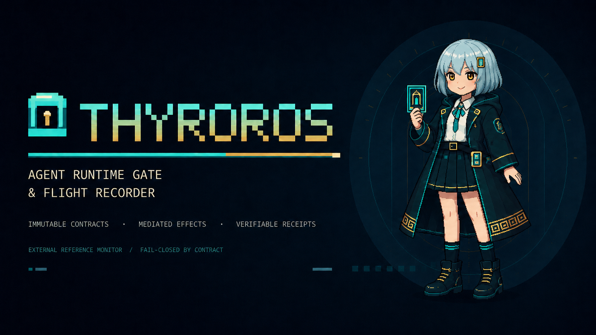
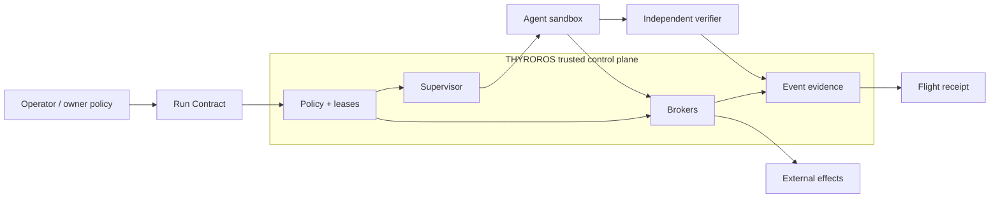

<div align="center">

# THYROROS

### Agent Runtime Gate & Flight Recorder

**External reference monitor for autonomous AI agents, built around immutable authority contracts, mediated effects, and verifiable receipts.**



<p>
  
  
  
  <a href="https://github.com/urotsuki-san/THYROROS/actions/workflows/ci.yml"></a>
</p>

**[Quick start](#quick-start)** · **[Architecture](#runtime-architecture)** · **[Threat model](docs/THREAT_MODEL.md)** · **[Security](SECURITY.md)** · **[Research](docs/RESEARCH.md)**

<sub>Pronunciation: <strong>/θi.roˈros/</strong> — roughly <strong>thee-ro-ROSS</strong> · Japanese project reading: <strong>シロロス</strong> · Status: <strong>research scaffold</strong></sub>

</div>

---

> [!IMPORTANT]
> **THYROROS is currently an R0 research scaffold, not an endpoint-protection product.**
>
> The repository currently provides deterministic Run Contract validation and authority-comparison primitives. It does **not yet** provide OS sandbox enforcement, MCP interception, credential brokering, or tamper-resistant audit guarantees.

THYROROS controls the boundary around an AI agent rather than asking one model to decide whether another model “looks safe.” Its long-term security thesis is:

> **Even when an agent is manipulated, it must not be able to perform effects outside the authority granted by its Run Contract.**

## What THYROROS is designed to do

<table>
<tr>
<td width="50%" valign="top">
<h3>🚪 Immutable Run Contracts</h3>
Authority is declared before execution: filesystem scope, network destinations, process limits, secrets, time, budgets, and maximum effect class.
</td>
<td width="50%" valign="top">
<h3>🧱 External security boundary</h3>
The monitored agent is not its own final policy authority. Policy, leases, enforcement, verification, and evidence live outside the planner.
</td>
</tr>
<tr>
<td width="50%" valign="top">
<h3>🔀 Mediated effects</h3>
File mutation, process creation, network access, Git effects, MCP calls, secret use, and persistent-memory updates are intended to cross named enforcement points.
</td>
<td width="50%" valign="top">
<h3>🧾 Verifiable flight receipts</h3>
Execution evidence is designed to bind the run contract, observed effects, verification result, coverage, and artifact digests without letting the worker certify itself.
</td>
</tr>
<tr>
<td width="50%" valign="top">
<h3>🛑 Fail-closed by contract</h3>
Unknown, missing, stale, contradictory, or weaker fallback evidence is not silently converted into permission.
</td>
<td width="50%" valign="top">
<h3>🧪 Independent verification</h3>
Agent stdout is not proof. Acceptance checks are designed to run outside the worker and bind results to the exact artifacts and policy revision being evaluated.
</td>
</tr>
</table>

## Run Contract: authority before execution

The R0 contract core makes authority explicit and machine-checkable before platform enforcement is introduced.

```text
Human task + owner policy
          │
          ▼
     Run Contract
          │
          ├─ read / write scope
          ├─ process authority
          ├─ network allowlist
          ├─ secret references
          ├─ resource ceilings
          ├─ maximum effect class
          └─ acceptance commands
          │
          ▼
   Agent execution
```

The central conservation rule is:

```text
child authority ⊆ parent authority
```

A child process, sub-agent, adapter, learned memory entry, or model decision may request less authority. It cannot widen the parent contract.

## Quick start

### PowerShell

```powershell
$env:PYTHONPATH = "src"
python -m thyroros name
python -m thyroros contract validate examples/run-contract.json
python -m thyroros contract digest examples/run-contract.json
python scripts/check_repo.py
```

### Linux / macOS development host

```bash
PYTHONPATH=src python -m thyroros name
PYTHONPATH=src python -m thyroros contract validate examples/run-contract.json
PYTHONPATH=src python -m thyroros contract digest examples/run-contract.json
PYTHONPATH=src python scripts/check_repo.py
```

Expected validation shape:

```text
PASS thyroros.run-contract v1
digest sha256:...
```

## Runtime architecture

The intended product boundary separates observation, decision, enforcement, verification, learning, and UI.



The real repository is not intended to be the normal writable workspace. Later milestones stage agent changes in a bounded workspace, verify them independently, then apply only an accepted Change Capsule.

See [`docs/ARCHITECTURE.md`](docs/ARCHITECTURE.md).

## Current R0 implementation

R0 is deliberately narrow and dependency-free. It currently provides:

- strict Run Contract validation;
- duplicate-key and unknown-field rejection;
- normalized relative-path checks;
- default-deny network contract validation;
- canonical SHA-256 document digests;
- ordered effect classes;
- conservative child-authority subset checks;
- deterministic machine-readable reason codes.

Current effect classes are:

```text
PURE
READ_IDEMPOTENT
WRITE_IDEMPOTENT
AT_MOST_ONCE
RECONCILE_REQUIRED
IRREVERSIBLE
```

Ambiguous completion of a non-idempotent effect is designed to reconcile external state rather than blindly replay the action.

## Protection grades

These grades describe future product behavior. **The current R0 repository does not yet satisfy any enforcement grade.**

| Grade | Meaning |
|---|---|
| **A — Native Mediated** | Every relevant tool/action is mediated with typed effect, identity, and lease. |
| **B — Sandboxed CLI** | OS isolation and staging workspace are enforced; semantic mediation is partial. |
| **C — Observe Only** | Telemetry only. No prevention guarantee. |

A future UI must not present Grade C as equivalent to enforced protection.

## Validation

The repository verification entry point checks the Python source, JSON schemas, example contract, unit tests, and obvious secret-like files:

```bash
PYTHONPATH=src python scripts/check_repo.py
```

This is engineering validation, not a security certification. A passing unit suite does not prove that a future Windows sandbox, network broker, or filesystem enforcement backend is secure.

<details>
<summary><strong>Build / install for development</strong></summary>

```bash
git clone https://github.com/urotsuki-san/THYROROS.git
cd THYROROS
python -m venv .venv
```

Windows:

```powershell
.\.venv\Scripts\python.exe -m pip install -e .
.\.venv\Scripts\python.exe scripts\check_repo.py
```

Linux / macOS:

```bash
./.venv/bin/python -m pip install -e .
./.venv/bin/python scripts/check_repo.py
```

</details>

## Documentation

| | Document |
|---|---|
| **Project charter** | [`docs/CHARTER.md`](docs/CHARTER.md) |
| **Threat model** | [`docs/THREAT_MODEL.md`](docs/THREAT_MODEL.md) |
| **Security invariants** | [`docs/SECURITY_INVARIANTS.md`](docs/SECURITY_INVARIANTS.md) |
| **Architecture** | [`docs/ARCHITECTURE.md`](docs/ARCHITECTURE.md) |
| **Mascot / hero art** | [`docs/MASCOT.md`](docs/MASCOT.md) |
| **Research references** | [`docs/RESEARCH.md`](docs/RESEARCH.md) |
| **Roadmap** | [`docs/ROADMAP.md`](docs/ROADMAP.md) |
| **Security reports** | [`SECURITY.md`](SECURITY.md) |

## Status

**0.1.0.dev0 · R0 research scaffold**

The contract core exists today. Windows constrained execution, mediated effects, independent signed receipts, stronger enforcement, behavioral evidence, and additional platforms remain staged research and implementation work.

See [`docs/ROADMAP.md`](docs/ROADMAP.md).
